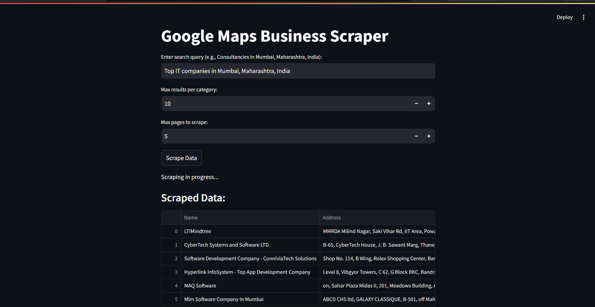
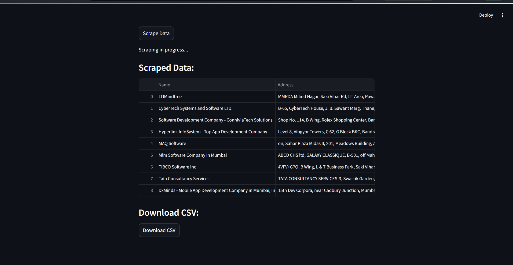

# Google Maps Lead Scraper🗺️

## 📌Problem Statement

Businesses, particularly the Pre-sales or Sales teams, often struggle to efficiently gather potential customers or leads from various sources. Finding the right leads is time-consuming and manually extracting details from platforms like Google Maps can be tedious. This process is often error-prone and lacks consistency, making it difficult for teams to compile a reliable and actionable list of potential clients.

## 💡Solution

The **Google Maps Lead Scraper** addresses this challenge by automating the process of scraping leads from Google Maps based on user-defined search queries. This tool helps the Pre-sales or Sales teams by extracting essential information such as business names, addresses, and websites, making it significantly easier to build a comprehensive lead list. The data can be downloaded in CSV format for easy integration into existing CRM systems, simplifying the lead generation process.

## 🎯Features

- **Automated Scraping**: Extracts business information from Google Maps based on the specified search query.
- **Customizable Search**: Allows users to specify the number of results and pages to scrape.
- **Data Filtering**: Automatically skips sponsored results and visited links to ensure the accuracy of the scraped data.
- **Downloadable Results**: Data can be downloaded in a CSV format for further processing or importing into other tools.
- **User-Friendly Interface**: Built with a modern UI using Streamlit, making the tool easy to use even for non-technical users.

## Images:

